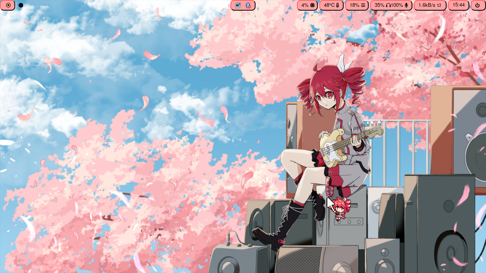
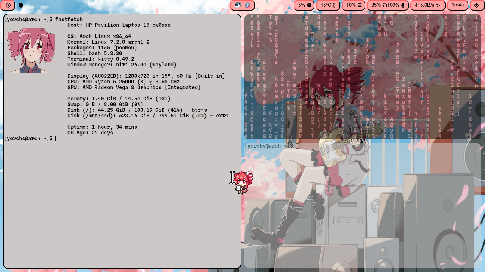

# Teto-niri-config-files
My shitty and simple config files for niri, waybar and others.   
Credits (i'll upload the rest later):  

Cursor: [Kasane Teto Cursor Pack](https://ko-fi.com/s/90a71e1b87)  
Waybar script: [gentoo waybar wiki](https://wiki.gentoo.org/wiki/Waybar#Applying_configuration_changes)  

## RyzenAdj 

This is optional because it fixes a strange behavior with the [znver1 mobile](./etc/systemd/system).

## Screenshots

